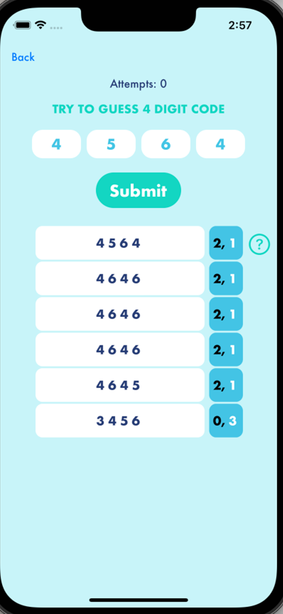

# NumWix

# Introduction

"NumWix" is a fun and challenging guessing game app that tests your deduction skills. The game generates a secret code consisting of a series of numbers, and your objective is to guess the code within a limited number of attempts. After each guess, the app provides feedback on which numbers are correct and in the correct position, and which numbers are correct but in the wrong position.

The app features customizable settings, including the length of the code and the number of attempts allowed. You can also view your past attempts and their results in the game history.

### Built with

- [Swift](https://www.swift.org/)

# Contact

Elena Zobak - [GitHub](https://github.com/elenazobak) | [LinkedIn](https://www.linkedin.com/in/elenazobak/)

App Store: https://apps.apple.com/us/app/numwix/id6448761871

